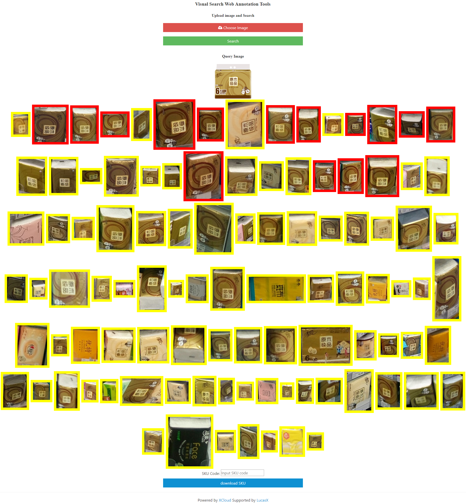

# CBIR Web Annotation Tools for XCloud

<p align="left"></p>

## Introduction
An online annotation toolkit with web-based UI for ```Image Retrieval/ReID``` tasks. It is freely accessible to **both research and industrial** fields.

**Note**: training and testing codes can be found from [XCloud](https://github.com/lucasxlu/XCloud/tree/master/research/cbir). 



### Backbone
| Architecture | Supervision | Status |
| :---: |:---: |:---: |
| DenseNet121 | Softmax | [YES] |
| DenseNet121 | CenterLoss | [YES] |
| DenseNet121 | A-Softmax | [YES] |
| ResNeXt50 | A-Softmax | [TODO] |
| SeResNeXt50 | A-Softmax | [TODO] |


### Dependency
 * [Faiss](https://github.com/facebookresearch/faiss.git)
 * [Django](https://www.djangoproject.com/)
 

## Citation
This tool is supplementary of [XCloud](https://github.com/lucasxlu/XCloud.git), If you use this tool in your research, please cite our [technical report](https://lucasxlu.github.io/blog/about/XCloud.pdf) about [XCloud](https://github.com/lucasxlu/XCloud.git) as:
```
@misc{xu2019xcloud,
  author =       {Lu Xu and Yating Wang},
  title =        {XCloud: Design and Implementation of AI Cloud Platform with RESTful API Service},
  howpublished = {\url{https://github.com/lucasxlu/XCloud.git}},
  year =         {2019}
}
```

 
## License
[MIT](./LICENSE)
